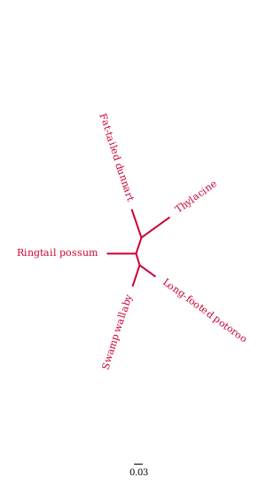
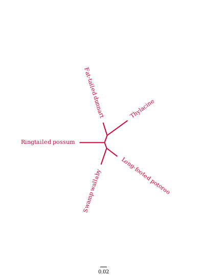

# amplicon-identifier
A tool for finding primers for amplicon sequencing metataxonomics

## Creating a sample dataset of mitogenomes

The same list of mitogenomes that were used for the initial iteration of the fat-tailed dunnart eDNA assay were also used here. The genome, their species' of origin, and identifiers are listed in the table below.

### List of mitogenomes

__Table 1__: Mitochondrial genomes of common contaminants, as well as a marsupial species of the same and a different order, thylacine and swamp wallaby respectively, were downloaded from the NCBI RefSeq or Genbank database.
|Species                     |RefSeq            |Genbank   |
|----------------------------|------------------|----------|
|*Sminthopsis crassicaudata* |NC_007631.1       |          |
|*Homo sapiens*              |NC_012920.1       |          |
|*Sus scrofa*                |NC_000845.1       |          |
|*Gallus gallus*             |NC_053523.1       |          |
|*Bos taurus*                |NC_006853.1       |          |
|*Wallabia bicolor*          |                  |KY996500.1|
|*Thylacinus cynocephalus*    |NC_011944.1       |          |

The data is saved in data/mitogenomes/set_1 of the LANIEL home directory on WSL of Lasse's Lenovo Laptop.

## Identifying conserved kmers using Jellyfish

### Install jellyfish

Install jellyfish in a seperate conda environment:

~~~
conda create --name jellyfish
conda activate jellyfish
conda install -c bioconda jellyfish
~~~

### Finding the longest conserved segment pair spanning a 200-500 bp region

To find the longest conserved fragments a script was written which runs sort_kmers.sh with a k-mer length starting at 20 bp and decreasing until a flanked fragment of 200-500 bp is found.

First sort-kmers.sh and find-conserved-kmers.sh were made executable from the command line.

~~~
chmod +x src/sort-kmers.sh
chmod +x src/find-conserved-kmers.sh
~~~

The search algorithm was then run while in the jellyfish environment.

~~~
bash src/find-kmer-length.sh ~/data/mitogenomes/set_1 ~/data/mitogenomes/set_1/sminthopsis-crassicaudata.fasta
~~~

## Filtering for effective primer pairs

### Isolating effective primer pairs with in_silico_PCR

Next, we identified potential amplification products from using the conserved sequences as primer binding sites.

This was done using [in_silico_pcr](https://github.com/egonozer/in_silico_pcr) which simply extracts sequences surounded by the primer binding sites, and setting the maximum length of the product to 500 bp.

__Installing in_silico_PCR__

To make in_silico_pcr executable from the command line the folder it was cloned to was added to PATH in the ~/.bashrc script,

~~~
export PATH=/home/laniel/tools:${PATH}
~~~

and the following command was run,

~~~
chmod +x ~/tools/bioinformatics/in_silico_pcr/in_silico_PCR.pl
~~~

__Running in_silico_PCR with the successful primer pairs against the mitogenomes__

After finding a set of primer pairs including at least one which amplification product in the reference species is 200-500 bp we ran in_silico_PCR on the full set of mitogenomes using the resulting set of primer pairs.

First the script format-effective-primer-pairs-for-in_silico_PCR.py was used to create the file effective_primer_pairs1.tsv in the results/in_silico_PCR folder.

The script was run with the following command:

~~~
python3 src/format-effective-primer-pairs-for-in_silico_PCR.py results/in_silico_PCR/amplifications.tsv results/in_silico_PCR/primer_pairs.tsv results/in_silico_PCR/effective_primer_pairs.tsv
~~~

in_silico_PCR was then run with the effective set of primers on the full set of mitogenomes.

~~~
in_silico_PCR.pl -s ~/data/mitogenomes/set_1.fasta -p results/in_silico_PCR/effective_primer_pairs.tsv -l 500 > results/in_silico_PCR/amplicons_full.tsv 2> results/in_silico_PCR/amplicons_full.fasta
~~~

The tab-separated file amplicons_full.tsv was then split into a fasta file for each primer pair using the script split-amplicons-by-primer-pair.py.

~~~
python3 src/split-amplicons-by-primer-pair.py results/in_silico_PCR/amplicons_full.tsv results/in_silico_PCR/amplicons_full.fasta results/fasttree/amplicons
~~~

The pipeline could then be picked up at the fasttree step using the amplicons generated by in_silico_PCR rather than the ones by ribdif2.

__Create a tree for the mitogenomes and every primer pair__

First fasttree was installed into a new environment.

~~~
conda create -n fasttree
conda activate fasttree
mamba install -c bioconda fasttree
~~~

Then the script generate-trees.sh was used to create phylogenetic trees from the amplicon fastas for each primer pair and the mitogenomes fasta.

~~~
bash src/generate-trees.sh ~/data/mitogenomes/set_1.fasta results/fasttree/amplicons results/fasttree
~~~

__Find the amplicon tree with the topology most similar to the mitogenome tree__

To find the primer pair that creates the best amplicons for delineating the focal species their topologies were compared with that of the mitogenome tree using the Robinson-Foulds distance.

This was done using the script src/compare-rf.py.

First an environment with biopython and dendropy was created.

~~~
conda create -n compare-rf
conda activate compare-rf
mamba install -c bioconda dendropy
mamba install -c bioconda biopython
~~~

The tree topologies were then compared with the command:

~~~
python3 src/compare-rf.py results/fasttree/mitogenome_tree.nwk results/fasttree/amplicon_trees/
~~~

## Blasting amplicons against NCBI database

The amplicons of the best tree were then blasted against NCBI's nucleotide database (nt) using a python script that bypassis the queue that is otherwise experienced when submitting blast searches from the command line.

~~~
python3 src/blast.py results/fasttree/amplicons/set_1-primer_pair95.amplicons.fasta results/blastn/
~~~

The resulting BLAST-hits can be seen in [results/blastn/results.blast](results/blastn/results.blast)

## Testing the program with marsupial genomes only

Next we assembled a set of mitogenomes for which we had tissue-derived DNA in the lab. This would allow us to test the primers designed with amplicon-identifier in vitro.

|Species                    |DNA available |Mitogenome available |
|---------------------------|--------------|---------------------|
|*Wallabia bicolor*         |Yes           |[Yes](../../../data/mitogenomes/marsupials-only/wallabia-bicolor.fasta)|
|*Pseudocheirus peregrinus* |Yes           |[Yes](../../../data/mitogenomes/marsupials-only/pseudocheirus-peregrinus.fasta)|
|*Potorous longipes*        |Yes           |[Yes](../../../data/mitogenomes/marsupials-only/potorous-longipes.fasta)|
|*Sminthopsis crassicaudata*|Yes           |[Yes](../../../data/mitogenomes/marsupials-only/sminthopsis-crassicaudata.fasta)|
|*Thylacinus cynocephalus*  |Yes           |[Yes](../../../data/mitogenomes/marsupials-only/thylacinus-cynocephalus.fasta)

A single fasta file containing the genomes were made using seqconverter

~~~
conda activate seqconverter
seqconverter -I fasta -O fasta ~/data/mitogenomes/marsupials-only/potorous-longipes.fasta ~/data/mitogenomes/marsupials-only/pseudocheirus-peregrinus.fasta ~/data/mitogenomes/marsupials-only/sminthopsis-crassicaudata.fasta ~/data/mitogenomes/marsupials-only/wallabia-bicolor.fasta ~/data/mitogenomes/marsupials-only/thylacinus-cynocephalus.fasta > ~/data/mitogenomes/marsupials-only.fasta
~~~

### Identifying a set of conserved fragments

Running 
 - sort-kmers.sh
 - find-conserved-kmers.sh
 - combine-primers.py
    
in loop with incrementally shorter k-mers until a fragment of at least 200 bp can be amplified:

~~~
conda activate jellyfish
bash src/find-kmer-length.sh ~/data/mitogenomes/marsupials-only ~/data/mitogenomes/marsupials-only/sminthopsis-crassicaudata.fasta
~~~

### Obtain amplicons from the effective primers

~~~
chmod +x src/generate-amplicons.sh
bash src/generate-amplicons.sh ~/data/mitogenomes/marsupials-only.fasta
~~~

### Generate trees from the amplicons

~~~
conda activate fasttree
bash src/generate-trees.sh ~/data/mitogenomes/marsupials-only.fasta results/fasttree/amplicons results/fasttree
~~~

### Compare Robinson-Foulds distance between amplicon trees and mitogenome tree

~~~
conda deactivate
conda activate compare-rf
python3 src/compare-rf.py results/fasttree/mitogenome_tree.nwk results/fasttree/amplicon_trees/
~~~

15 amplicon trees resulted in a Robinson-Foulds distance of 0. The mitogenome tree and the first of the amplicon trees with an RF Dist=0, primer_pair336.amplicons_tree.nwk, is shown below.

__Figure 7:__ Full mitogenome tree of the marsupial dataset.

__Figure 8:__ Amplicon tree from primer_pair336 of the marsupial dataset.

### BLASTing the amplicons from the best tree against NCBI Nucleotide

~~~
python3 src/blast.py results/fasttree/amplicons/primer_pair336.amplicons.fasta results/blastn/
~~~

All the amplicons of primer_pari336 map to the expected species first, all with a 100% identity. The results can be found in [results/blastn/results.blast](results/blastn/results.blast).

